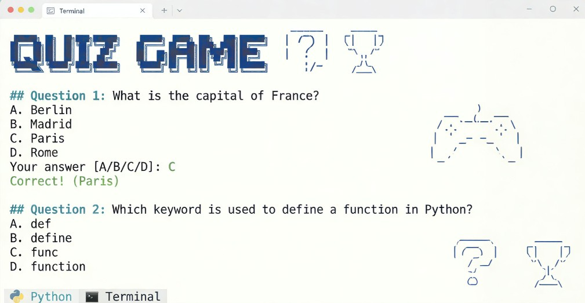

# 🐍 Python Projects Gallery

A comprehensive collection of Python programming projects, organized into beginner-friendly mini-projects and advanced major projects.

---

## 📑 Table of Contents
* [📂 Directory Structure](#-directory-structure)
* [🛠️ 01: Python Mini-Projects](#️-01-python-mini-projects)
  * [1. Quiz Game](#1-quiz-game)
  * [2. Number Guessing](#2-number-guessing)
  * [3. Rock Paper Scissors](#3-rock-paper-scissors)
  * [4. Dice Roller](#4-dice-roller)
  * [5. Cipher Encryption](#5-cipher-encryption)
  * [6. Credit Card Validator](#6-credit-card-validator)
  * [7. Banking Program](#7-banking-program)
  * [8. Hangman](#8-hangman)
  * [9. ATM Simulation](#9-atm-simulation)
  * [10. Custom Data Type (OOP)](#10-custom-data-type-oop)
* [🚀 02: Python Major Projects](#-02-python-major-projects)

---

## 📂 Directory Structure

* **[01-python-mini-projects/](./01-python-mini-projects/)**: 10 essential scripts covering logic, games, and OOP basics.
* **[02-python-major-projects/](./02-python-major-projects/)**: Scalable, complex applications (Coming Soon).

---

## 🛠️ 01: Python Mini-Projects

### 1. Quiz Game
**File:** [`01-quiz-game.py`](./01-python-mini-projects/01-quiz-game.py)  
An interactive terminal-based quiz that challenges users with multiple-choice questions. 
The program utilizes dictionary structures for question storage, tracks real-time scoring, 
and provides instant correct/incorrect feedback through conditional control flow.

### 2. Number Guessing
**File:** [`02-number-gussing-game.py`](./01-python-mini-projects/02-number-gussing-game.py)  
A logic game where the computer selects a secret number and the user attempts to guess it. 
It features a while-loop for continuous play, uses the `random` module for number generation, 
and implements comparison operators to provide "Higher" or "Lower" hints to the player.

### 3. Rock Paper Scissors
**File:** [`03-rock-paper-sissor.py`](./01-python-mini-projects/03-rock-paper-sissor.py)  
A digital version of the classic hand game featuring a randomized computer opponent. 
The script demonstrates the use of list-based choices and nested `if-elif-else` statements 
to determine the winner while handling user input validation for valid moves.

### 4. Dice Roller
**File:** [`04-dice-roller.py`](./01-python-mini-projects/04-dice-roller.py)  
A utility script that simulates the physics of rolling dice by generating random integers. 
It includes features to specify the number of dice and the number of sides per die, 
showcasing simple mathematical operations and the versatility of the Python `random` library.

### 5. Cipher Encryption
**File:** [`05-cipher-encryption.py`](./01-python-mini-projects/05-cipher-encryption.py)  
A cryptography tool designed to secure text by shifting characters using a specific key. 
The project highlights advanced string manipulation, ASCII character mapping, 
and loops to iterate through data while maintaining text formatting and symbols.

### 6. Credit Card Validator
**File:** [`06-credit-card-validator.py`](./01-python-mini-projects/06-credit-card-validator.py)  
An application that verifies the mathematical validity of a credit card number using the Luhn Algorithm. 
It processes input strings as lists of integers, applies doubling logic to specific indices, 
and uses modulo arithmetic to confirm if the total sum meets the validation checksum requirements.

### 7. Banking Program
**File:** [`07-banking-program.py`](./01-python-mini-projects/07-banking-program.py)  
A terminal interface simulating a bank account management system for checking balances. 
The script defines functions for deposit and withdrawal logic, ensuring that 
numerical values are updated correctly and that accounts cannot be overdrawn.

### 8. Hangman
**File:** [`08-hangman.py`](./01-python-mini-projects/08-hangman.py)  
A comprehensive word-guessing game that utilizes a visual gallows to track player failure. 
It manages state through lists for correctly guessed letters and remaining lives, 
demonstrating complex string formatting and character replacement in real-time.

### 9. ATM Simulation
**File:** [`09-atm.py`](./01-python-mini-projects/09-atm.py)  
A simulated ATM experience that focuses on secure user authentication and menu-driven navigation. 
The program uses a continuous loop to provide multiple transaction options like withdrawals 
and balance inquiries, using flag variables to manage session logout and exit conditions.

### 10. Custom Data Type (OOP)
**File:** [`10-custom-dataType-oop.py`](./01-python-mini-projects/10-custom-dataType-oop.py)  
A foundational project introducing Object-Oriented Programming (OOP) concepts in Python. 
It demonstrates how to define a `class`, use the `__init__` constructor method, 
and create custom object instances